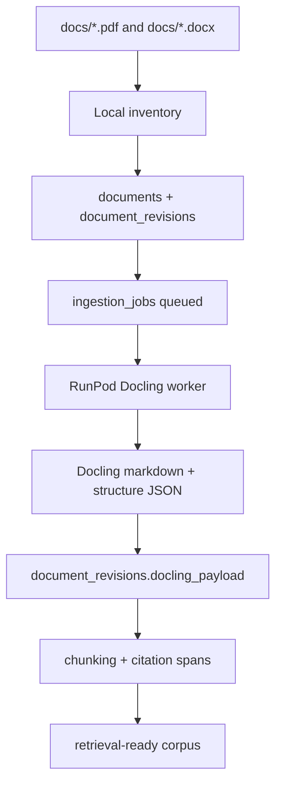

# Docling On RunPod Plan

## Goal

Use RunPod workers to run Docling over the Ghana Health Service document corpus and store high-quality structured extraction results in Postgres.

## Data Flow



## Transfer Strategy

Small files can be sent inline as base64 to a RunPod queue endpoint during development.

Large files should not be sent inline. Several GHS PDFs are larger than 30 MB, and the largest observed file is about 79 MB. For production ingestion, use one of these patterns:

- deploy the backend with signed document download URLs and let RunPod fetch each file
- upload originals to object storage and pass signed URLs to RunPod
- mount a RunPod network volume populated with the corpus

The preferred production path is signed URLs/object storage, because it works with queued serverless jobs and keeps the worker stateless.

## Worker Contract

Input:

```json
{
  "filename": "GHS CODE OF CONDUCT AND DISCIPLINARY PROCEDURES 2018.pdf",
  "source_path": "GHS CODE OF CONDUCT AND DISCIPLINARY PROCEDURES 2018.pdf",
  "mime_type": "application/pdf",
  "document_title": "GHS CODE OF CONDUCT AND DISCIPLINARY PROCEDURES 2018",
  "file_base64": "development-only",
  "file_url": "production preferred"
}
```

Output:

```json
{
  "source_path": "...",
  "document_title": "...",
  "engine": "docling",
  "markdown": "...",
  "document": {},
  "page_count": 42,
  "preview": "..."
}
```

## Next Step After Extraction

Docling output should be transformed into:

- `document_sections`
- `chunks`
- `citation_spans`
- extraction quality flags
- policy metadata summaries

The quality pass should flag scanned documents, weak text extraction, missing page mapping, and documents where Docling output is mostly images.
