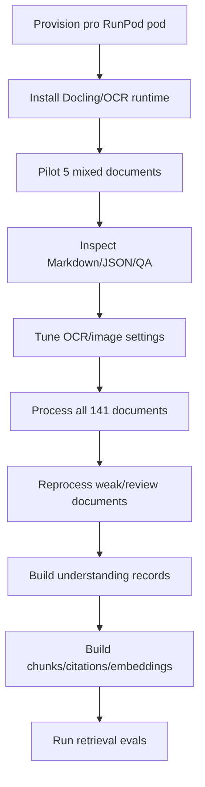

# One-Time Corpus Build Runbook

## Objective

Build the frozen Ghana Health Service policy corpus once, at maximum practical quality.

This is not a recurring ingestion pipeline. The target output is a durable corpus bundle:

- originals in Tigris
- Docling structured JSON
- Docling Markdown
- OCR text where needed
- table/image/page structure
- quality reports
- later: document understanding, section understanding, policy relationships, chunks, citations, embeddings

## Recommended Pod

Use a persistent RunPod pod:

```text
GPU: L40S 48 GB preferred
Fallback: RTX 6000 Ada 48 GB, A40 48 GB, RTX A6000 48 GB
RAM: 90 GB+
vCPU: 16+
Disk: 250-500 GB
Template: PyTorch CUDA / Ubuntu
```

## Build Phases



## Commands

After SSH into the pod:

```bash
apt-get update
apt-get install -y poppler-utils tesseract-ocr tesseract-ocr-eng libreoffice curl git

cd /workspace
python -m venv ghs-corpus
source /workspace/ghs-corpus/bin/activate
pip install --upgrade pip
pip install -r "/workspace/Ghana Health Service/workers/pod-batch/requirements.txt"
```

Set env vars:

```bash
export DATABASE_URL='postgresql://...'
export AWS_ACCESS_KEY_ID='...'
export AWS_SECRET_ACCESS_KEY='...'
export AWS_ENDPOINT_URL_S3='https://fly.storage.tigris.dev'
export AWS_REGION='auto'
export BUCKET_NAME='ancient-sun-4815'
export GHS_WORKER_DIR='/workspace/ghs-corpus-work'
```

Pilot:

```bash
python "/workspace/Ghana Health Service/workers/pod-batch/run_corpus_build.py" --limit 5
```

Full batch:

```bash
python "/workspace/Ghana Health Service/workers/pod-batch/run_corpus_build.py" --limit 200
```

## QA

Review each `qa-report.json` for:

- low text volume
- low text-per-page ratio
- missing page count
- scanned/image-heavy documents
- failed extraction

Documents with `reviewFlag=true` should be manually inspected and reprocessed with stronger OCR settings if needed.

## After Extraction

Run the understanding pass:

- document profiles
- section profiles
- policy areas
- role/procedure/obligation extraction
- relationships between policies
- chunking and citation spans
- embeddings and retrieval tests
