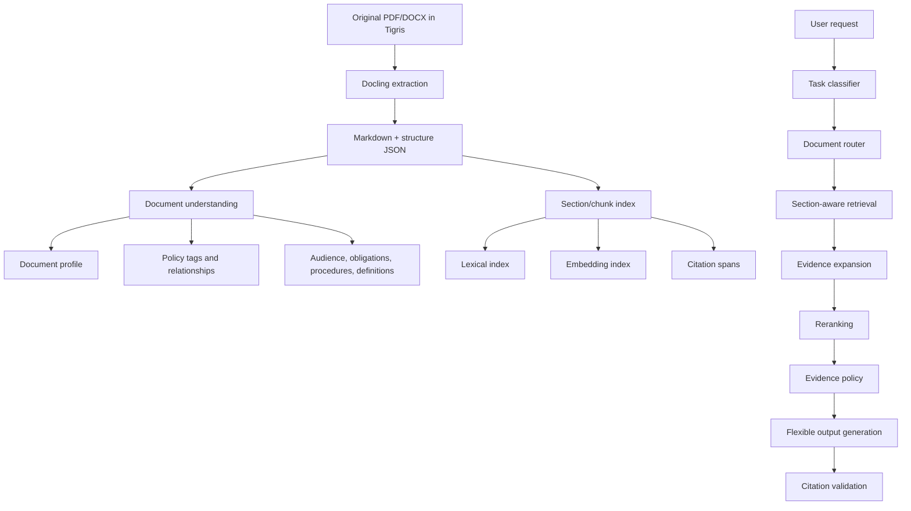
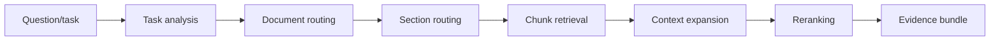

# Policy Understanding And Retrieval Plan

## Purpose

After Docling extracts the Ghana Health Service corpus, the system needs a second layer that understands what each document is for and how its parts should be retrieved for user problems.

The goal is not fixed workflows. The goal is flexible problem solving over a grounded corpus:

```text
user problem -> task understanding -> document/section retrieval -> evidence bundle -> answer/checklist/table/plan with citations
```

## Architecture



## Understanding Objects

### DocumentUnderstanding

One per document revision.

Fields:

- document purpose
- policy area
- issuing authority
- effective date/year
- target audience
- scope
- key definitions
- key obligations
- roles and responsibilities
- procedures
- forms/checklists/templates
- compliance/audit requirements
- implementation steps
- related documents
- common user questions this document can answer

### SectionUnderstanding

One per major section or heading path.

Fields:

- heading path
- summary
- section type: `definition`, `obligation`, `procedure`, `role`, `form`, `standard`, `background`, `metric`, `appendix`
- likely intents
- important entities
- page range
- related sections

### PolicyRelationship

Links documents and sections.

Relationship examples:

- `updates`
- `supersedes`
- `implements`
- `related_to`
- `conflicts_with`
- `defines_terms_for`
- `procedure_for`
- `monitoring_framework_for`

## Retrieval Strategy

Use a staged retrieval pipeline.



### Task Analysis

Classify the user request into flexible task modes:

- answer
- summarize
- compare
- extract
- checklist
- table
- implementation plan
- training notes
- compliance review
- explain for audience
- draft from policies

This classification should guide retrieval, not restrict what users can ask.

### Document Routing

Pick likely documents using:

- title and filename
- document understanding profile
- policy area tags
- audience
- issuing authority
- topic keywords
- semantic embeddings
- related document graph

### Section Routing

Within selected documents, route to likely section types:

- checklist task -> obligations, procedures, forms
- comparison task -> objectives, requirements, procedures across documents
- role question -> responsibilities/authority sections
- implementation request -> procedures, standards, monitoring, appendices
- definition request -> definitions/glossary

### Evidence Expansion

When a chunk is selected, also retrieve:

- heading path
- section summary
- previous and next chunk
- relevant table/list continuation
- document profile
- related sections if the relationship graph says they matter

## GPT Access To Documents

The backend should give ChatGPT access through tools, not raw storage credentials.

Allowed access patterns:

- `search` returns canonical document or section results
- `fetch` returns text for a selected document/section/chunk
- `ghs.work_with_policies` returns an evidence bundle and generated answer
- `ghs.get_sources` returns citations and signed source URLs when useful

Original files live in Tigris. The backend can generate short-lived signed URLs for:

- Docling workers
- user-visible source download/open actions
- internal review tools

Do not expose permanent Tigris object URLs or storage credentials to ChatGPT.

## Source Reading Contract

The app should support two levels of reading:

1. Evidence-first reading:
   - retrieve relevant chunks and spans
   - answer from the evidence bundle
   - cite pages/spans

2. Full-source reading:
   - fetch larger section or full extracted text when the task needs broad context
   - use original signed source links for human inspection
   - still cite the exact evidence used in the final answer

## Data Model Additions

Add after Docling extraction is flowing:

- `document_understandings`
- `section_understandings`
- `policy_relationships`
- `document_topics`
- `chunk_embeddings`
- `retrieval_feedback`
- `eval_cases`

## Quality Bar

Retrieval is good enough when the system can:

- find the right document even when the user does not know its exact title
- answer procedure and responsibility questions with source pages
- compare two or more policies without mixing unsupported claims
- turn policy evidence into practical checklists and implementation plans
- identify when evidence is weak, missing, outdated, or conflicting
- let ChatGPT fetch/read source material through controlled tools

The fixed part is not the workflow. The fixed part is evidence, citation, access control, and audit.
